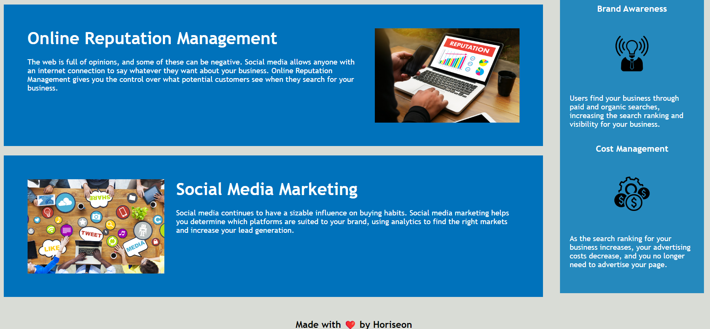

# CODE REFACTORING   <image src="https://img.shields.io/badge/license-MIT-green/size=100"> 
## Live deployment

https://jack-educational.github.io/code-refactoring/
  
  ## Description
  This is the first assignment of the frontend developer bootcamp that is in the style of an on-the-job ticket. This means we begin with starter code that we need need to modify. The modification involves accessibility improvement such as addition of ALT attributes to IMG tags as well as refactoring the HTML to make use of semantic tags which are structured appropriately e.g. headings in the correct hierarchy.
  
  ## Table of Contents

- [Live deployment](#live-deployment)
- [Description](#description)
- [Table of Contents](#table-of-contents)
- [Installation](#installation)
- [Usage](#usage)
- [License](#license)
- [Contributing](#contributing)
- [Questions](#questions)

  ## Installation
  Simply navigate to the live deployment URL at the top of the readme and view the page. No installation required.
  
  ## Usage
  Simply navigate to the live deployment URL. The page will look like the following image:
   
  

  
  ## License
  
  This application is covered under the MIT license.
  
  ## Contributing
  any contributions are welcome, feel free to fork, star and contact me using the email address on my gitub profile
  
  ## Questions
  If you have any questions, please contact me using the email address on https://github.com/neverekt

